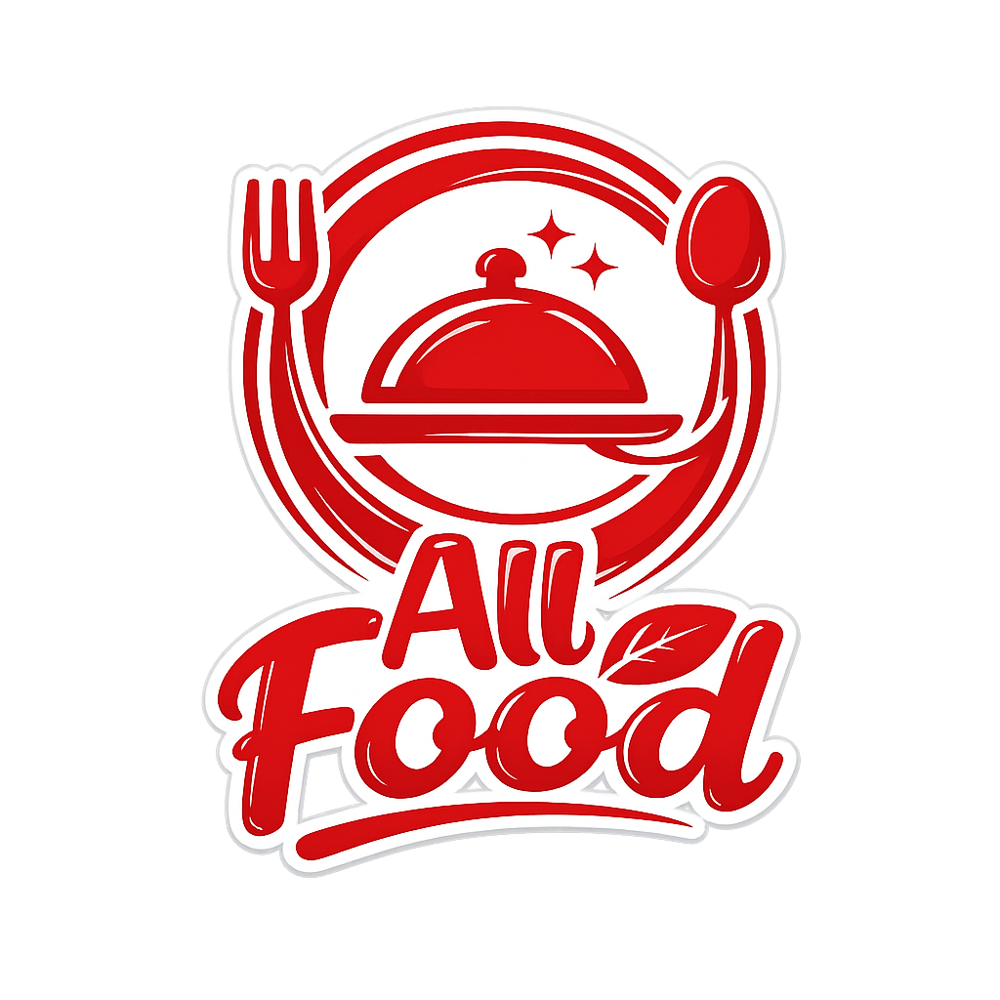
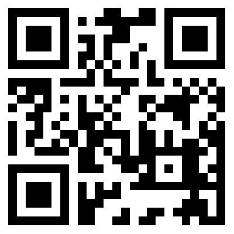
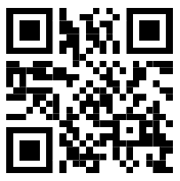

# All Food

Aplicación móvil para la gestión de restaurante.

## Stack tecnológico

- Flutter
- Supabase

## Estado actual

Base funcional implementada:

- Inicialización de Supabase por variables de entorno
- Splash screen con animaciones + branding en rojo (logo e ícono personalizados)
- Inicio de sesión con validaciones
- Ingreso rápido por perfiles demo (dueño, supervisor, cocinero y cantinero)
- Registro de cliente registrado con foto de cámara, validaciones y estado pendiente de aprobación
- Registro de cliente anónimo con foto de cámara (perfil `cliente_anonimo`, estado `aprobado`)
- Lector QR/PDF417 de DNI para autocompletar datos en los formularios
- Alta de empleados (dueño/supervisor), incluyendo validaciones y carga de foto
- Gestión de clientes pendientes (aceptar/rechazar) para dueño/supervisor
- Home con accesos según rol
- Alta de productos (platos y bebidas) con validaciones e imágenes
- Alta de mesas + visualización/edición de mesas
- Cierre de sesión con feedback visual

## Integrantes

- Luciano Bordón
- Pio Acosta
- Adrián Lezcano

## Comandos útiles

```bash
flutter pub get
flutter analyze
flutter run
```

## QR de entrada (lista de espera)

Para anotarse en la lista de espera, el cliente debe escanear el QR de entrada.

![QR de entrada]

----
## QR Mesas
| Mesa | QR |
|------|----|
| Mesa 1 |  |
| Mesa 2 |  |
| Mesa 3 |  |

Pantallas de la aplicación

SplashScreen


## Lista de tareas realizadas

**Apellidos y nombres:** Acosta Abasto Pio.

**Módulos (objetivos) a desarrollar:**

1. Deploy inicial + base de registro, login y home. | Fecha de inicio de la tarea: 28/03/2026 | Fecha de finalización de la tarea: 28/03/2026

2. Actualización de colores principales (azul -> rojo). Agregar logo e incluirlo en el splash | Fecha de inicio de la tarea: 06/04/2026 | Fecha de finalización de la tarea: 06/04/2026.

3. Ingreso rápido a la pantalla de ingreso (para dueño) y alerta al cerrar sesión. | Fecha de inicio de la tarea: 06/04/2026 | Fecha de finalización de la tarea: 06/04/2026.

4. Creación de la función "alta de empleados" para roles de dueño y supervisor. | Fecha de inicio de la tarea: 10/04/2026 | Fecha de finalización de la tarea: 10/04/2026

5. Actualización del spinner con logo y círculo de carga. | Fecha de inicio de la tarea: 10/04/2026 | Fecha de finalización de la tarea: 10/04/2026

6. Corrección de UI para pantallas de alta de empleados, inicio de sesión y registro. Ahora ocupa mejor los espacios y se eliminó el scroll horizontal. | Fecha de inicio de la tarea: 11/04/2026 | Fecha de finalización de la tarea: 11/04/2026

7. Crear mesas, verlas y editarlas. | Fecha de inicio de la tarea: 11/04/2026 | Fecha de finalización de la tarea: 11/04/2026

8. Ingreso como cliente anónimo. | Fecha de inicio de la tarea: 14/04/2026 | Fecha de finalización de la tarea: 14/04/2026

9. Generar código QR al crear una mesa. Visible en ver/editar mesa. | Fecha de inicio de la tarea: 15/04/2026 | Fecha de finalización de la tarea: 15/04/2026

---

**Apellidos y nombres:** Lezcano Adrian.

**Módulos (objetivos) a desarrollar:**

1. Splash screen con sus respectivas animaciones (logo a modificar). | Fecha de inicio de la tarea: 31/03/2026 | Fecha de finalización de la tarea: 01/04/2026

2. Implementación de registro cliente con todos sus respectivos datos pendiente de aprobación. | Fecha de inicio de la tarea: 06/04/2026 | Fecha de finalización de la tarea: 07/04/2026

3. Funcionalidad "aceptar/rechazar clientes pendientes" para roles de dueño y supervisor. | Fecha de inicio de la tarea: 10/04/2026 | Fecha de finalización de la tarea: 10/04/2026

4. Modulo de asignar mesa, creación del modulo en donde el metre tiene una lista de clientes aprobados y puede asignarle una mesa que no está en uso | Fecha de finalización de la tarea: 15/04/2026

5. Formulario de alta de clientes para el perfil metre | Fecha de inicio de la tarea: 16/04/2026 | Fecha de finalización de la tarea: 16/04/2026

6. Implementacion de consultas por chat entre cliente y mozos | Fecha de inicio de la tarea: 16/04/2026 | Fecha de finalización de la tarea: 17/04/2026

---

**Apellidos y nombres:** Bordón Luciano.

**Módulos (objetivos) a desarrollar:**

1. Icono de la aplicación personalizado. | Fecha de inicio de la tarea: 06/04/2026 | Fecha de finalización de la tarea: 06/04/2026

2. Modularización y alta de producto (alta de platos y bebidas con validación de datos e imágenes). | Fecha de inicio de la tarea: 09/04/2026 | Fecha de finalización de la tarea: 12/04/2026

3. Implementación de carta para cantinero y cocinero junto con su detalle de producto, incluyendo modelos, repositorio y servicios. | Fecha de inicio de la tarea: 13/04/2026 | Fecha de finalización de la tarea: 14/04/2026

4. Se implemento la carta de cliente donde podra realizar pedidos | Fecha de inicio de la tarea: 15/04/2026 | Fecha de finalización de la tarea: 15/04/2026

5. Implementación de lógica para el envío automático de correos electrónicos al aceptar o rechazar una cuenta con perfil de dueño o supervisor. | Fecha de inicio de la tarea: 16/04/2026 | Fecha de finalización de la tarea: 16/04/2026

6. Configuracion e implementacion de notificaciones push para el aviso a dueño o supervisor de un nuevo cliente registrado | Fecha de inicio de la tarea: 17/04/2026 | Fecha de finalización de la tarea: 20/04/2026

7. Configuración e implementación de notificaciones push para todo el flujo de pedido | Fecha de inicio de la tarea: 17/04/2026 | Fecha de finalización de la tarea: 24/04/2026

8. Se implementó la lectura de QR para seleccionar el porcentaje de propina al momento del pago. El cliente escanea el QR correspondiente a su nivel de satisfacción (Excelente 20%, Muy bueno 15%, Bueno 10%, Regular 5%, Malo 0%) y el monto se aplica automáticamente al total antes de confirmar el pago.Fecha de inicio de la tarea: 24/04/2026 | Fecha de finalización de la tarea: 25/04/2026

---


# Qr de propinas

| Nivel       | Propina | QR |
|------------|--------|----|
| Excelente  | 20%    |  |
| Muy Bueno  | 15%    |  |
| Bueno      | 10%    |  |
| Regular    | 5%     |  |
| Malo       | 0%     |  |
